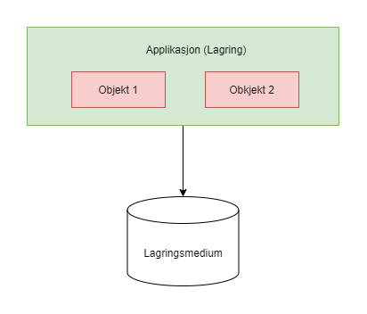
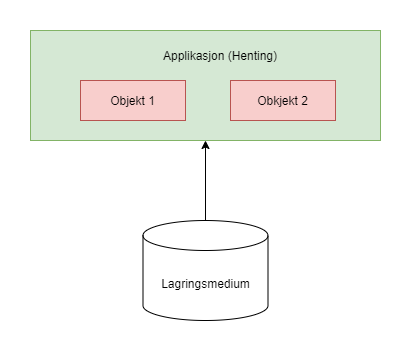

# QSettings og Views

## QStringView class

QStringView class brukes når du ønsker å vise en string brukeren men ikke la brukere ha muligheten til å modifisere underliggende variabelen.

- **Fordel:** rask tilgang og er ikke modifiserbar.

- **Tommelfingerregel:** hvergang du ser View, tenk at det er "Read-only".

View classene har mange funksjoner vi kan kalle på, og ingen av funksjonene modifiserer den underliggende variabelen.

### Eksempel QByteArrayView

Når vi kaller på funksjonen "show" og endrer parameteren "view" så vil den ikke endre den underliggende verdien av "str" variabelen.

```C++
QByteArray str("Dette er applikasjonsutvikling"); // Opprinnelig verdi
QByteArrayView viewStr(str); // Lager en view av str

void show(QByteArrayView &view)
{
    view = "Endrer verdien lokalt i denne funksjonen"; // endrer view lokalt, men Endrer ikke "str"!
    qInfo() << view;
}

// Kalle på show
show(viewStr); // Denne vil vise: "Endrer verdien lokalt i denne funksjonen"
qInfo() << str; // Denn vil vise: "Dette er applikasjonsutvikling"
```

### Når vi jobber med QStringView:

Samme prinipp som QByteArrayView, men QStringView er bygget på QString. Dere kan se i dokumentasjonen for å se de forskjellige konstruktørene.

```C++
void show(QStringView &view)
{
    view = "kmf"; // Dette er ikke lov for QString, siden operator= er ikke implementert for QStringView
    qInfo() << view;
    qInfo() << view.size();

    for(auto &ch: view){
        qInfo() << ch;
    }
}
```

# Settings

QSettings Class gir muligheten til å lagre applikasjons innstillinger. Vi kan lagre våre innstillinger når vi avslutter programmet og laste det opp igjen når vi starter igjen programmet.

**QVariant:** Virker som union, du kan lagre alle datatyper i en QVariant variabel. Vi kan for eksempel lagre data fra en function i en QVariant når vi ikke vet hvilket data type funksjonen returnere.

**Når vi lagrer innstillinger:**



**Når vi henter innsillinger:**


