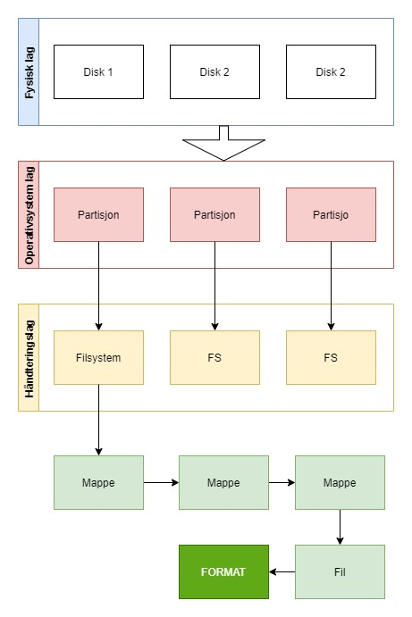

# File system

- QIODevice
- Skrive til filer
- Lese fra filer

I denne leksjonen skal vi se på filsystemer. Nedenfor ser vi hvordan filsystemer kan beskrives på en enkel måte.

**Filesystem(FS)** beskriver hvordan vi beskriver hvordan hvordan vi skal lagre filene.
<br> **Format:** en fil har en format som beskriver hvordan filen ser ut. Eks. en text fil er forskjellig fra en excel fil.
<br>**Partisjon** er en logisk del av disken som referer til en fysisk del. I hver partisjon ligger **volum** som er en logisk del av partisjonen og kan aksesserer av OS brukeren som inneholder et filsystem. Filsystemet som lar deg lagre filene dine.<br>



# QIODevice

QIODevice er en base interface klasse for alle I/O enheter i Qt. Det er en abtrakt klasse, og vi kan arve funksjonaliteter til vår egen klasse. De vil si at vi kan få de samme grensesnittet ved å arve fra QIODevice. De eneste funksjonene vi må implementere er readData() og writeData() funksjonene og da vil QIODevice bruke de funksjonene til å implementere alle andre funksjoner i klassen.

## QBuffer

QBuffer klassen bruker QDevice grensesnittet for QByteArray. QByteArray blir behandlet som standard random-accessed fil.

**Random Access Files** består av lagret data som kan bli aksessert i hvilket som helst rekkefølge. Det vil si at dataene lagres akkurat som de vises i minnet. Du får rask tilgang til å lese og skrive og kan hoppe fram og tilbake i data sekvensen som er lagret veldig kjapt. Men dataene er ikke transportbare, du kan ikke åpne filen i en editor som Word. Mere info om [Random Access Files](http://www.manmrk.net/tutorials/basic/PowerBASIC/PBWINH/Random_Access_Files.html).

### Eksempel QBuffer

```C++
#include <QCoreApplication>
#include <QIODevice>
#include <QBuffer>

int main(int argc, char *argv[])
{
    QCoreApplication a(argc, argv);
    QBuffer buffer;

    /*
     * Vi kan se flaggene via: QIODevice::OpenModeFlag::
     */

    if(buffer.open(QIODevice::OpenModeFlag::ReadWrite)){
        qInfo() << "Device is open";

        QByteArray data("Hello wordl");

        for(int i=0; i < 10; i ++){
            buffer.write(data);
            buffer.write("\r\n"); // "\r\n" er samme som å press "Enter" når du skriver i en editor
        }

        /* Tenk på det som en bok. Vi er på side nr. 10 etter loppen
         * seek funksjonen hopper til angitt posisjon i filen
         */
        buffer.seek(0);

        qInfo() << buffer.readLine();
        qInfo() << buffer.readAll();
        qInfo() << "Closing the buffer";
        /*
         * Vi bør stenge den med engang vi åpner
         * Eller vil ikke andre programmer/funksjoner kunne opne filen
        */
        buffer.close();
    }
    else
    {
        qInfo() << "Could not open the device";
    }

    qInfo() << "Finished";
    return a.exec();
}

```

## QFile

QFile tilbyr en krensesnitt til å lese og skrive til filer. Se eksemplet fra forelesning og les dokumentasjonen for flere andre funksjonaliteter.

```C++
#include <QCoreApplication>
#include <QFile>
#include <QDateTime>

int main(int argc, char *argv[])
{
    QCoreApplication a(argc, argv);

    /* Lagrer filen i prosjektmappen siden vi ikke har definert hvor det skal lagres*/
    QString filename = "fagskolen_i_viken.txt";

    QFile file(filename);
    if (file.open(QIODevice::WriteOnly)){

        QString now = QDateTime::currentDateTime().toString();
        QByteArray data;
        data.append(now.toLocal8Bit());
        data.append(" _ ");
        data.append("Hei alle studenter!");

        qInfo() << file.write(data);
        /* close() kallser flush() automatisk.
         * flush, sletter alle bufferet data til filen.
         */
        file.close();
    }
    else {
        qInfo() << file.errorString();
    }

    return a.exec();
}

```

### Sette "path"

Eksempel på hvordan du lagrer filen på en plass du ønsker. Du må inkludere QDir.

```c++

 QFile file;
    QDir::setCurrent("C:/Users/Shahin Ostadahmadi/OneDrive - USN/Skrivebord");
    file.setFileName(filename);
    QDir::setCurrent("/home");

```

### Legge til data til en file (ikke overskrive data som ligger i filen)

Eneste endringer vi trenger å gjøre er å opne filen i en annen modus, altså "append" modus.

```c++
// Byttte fra:
file.open(QIODevice::WriteOnly)

// Til:
file.open(QIODevice::Append)
```

### Lese filer

Når vi skal bestemme hvilket modus vi ønsker å legge å åpne filen med, bør vi åpne det med minst mulige tillatelser. Skal du kun lese fra så bør åpne den i lese modus slik at av andre programmer også kan lese fra samme fil samtidig.

Vi kan også benytte av oss andre funksjoner for å lese en linje eller antall tegn som vi ønsker.

```c++
  if(file.open(QIODevice::ReadOnly))
    {
        // Leser alt
        qInfo() << "Reading the file:\r\n";
        qInfo() << file.readAll();
        file.close();
    }
    else {
        qInfo() << file.errorString();
    }
```
