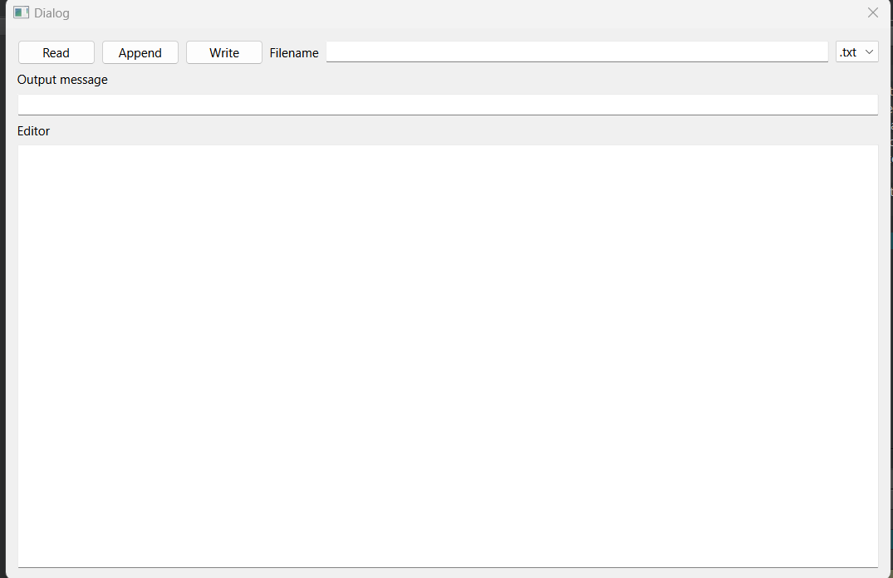

# Oppgave til filsystemer

Her er koden vi rakk å skrive for **write** funksjonen i forelesning. Din oppgave blir å skrive ferdig funksjonen. Oppgaven teksten er etter bildet av editoren.

### Hvordan editoren ser ut:



### Oppgave

Rediger funksjonen slik at vi kan skrive lese fra en fil med **READ** knappen(denne er implementert), så kan vi redigere filen i editoren og skrive det tilbake til filen.

Se også notater for eksempler og bruk gjerne dokumentasjonen (åpnes med **F1**) for å se hvordan funksjonene fungerer.

1. Implementer Write knappen slik at den er koblet til **write** funksjonen i koden
2. **TODO 1:** Hvis filen ikke finnes så skal en en `QMessageBox` komme opp og gi en feilmelding om at filen ikke eksisterer også gå ut av av **write** funksjonen.
3. **TODO 2:** etter IF-testen skal du hente alt som står i editoren (TextEdit) og skriv det til filen.

Hvi du ønsker så kan du også implementer steg 2 slik at du får et valg om å opprette filen som ikke finnes etter feilmeldingen.

### Koden:

```c++
void Dialog::write()
{
    QString filename = ui->LEFileName->text() + ui->CMBfileFormat->currentText();
    QFile file(filename);

    // TODO 1
    if(!file.exists()){
        ui->LEoutPut->setText("File do not exist!");
        return;
    }

    if(file.open(QIODevice::WriteOnly)){
        // TODO 2


        file.close();
    }
    else {
        ui->LEoutPut->setText(file.errorString());
    }
}

```
