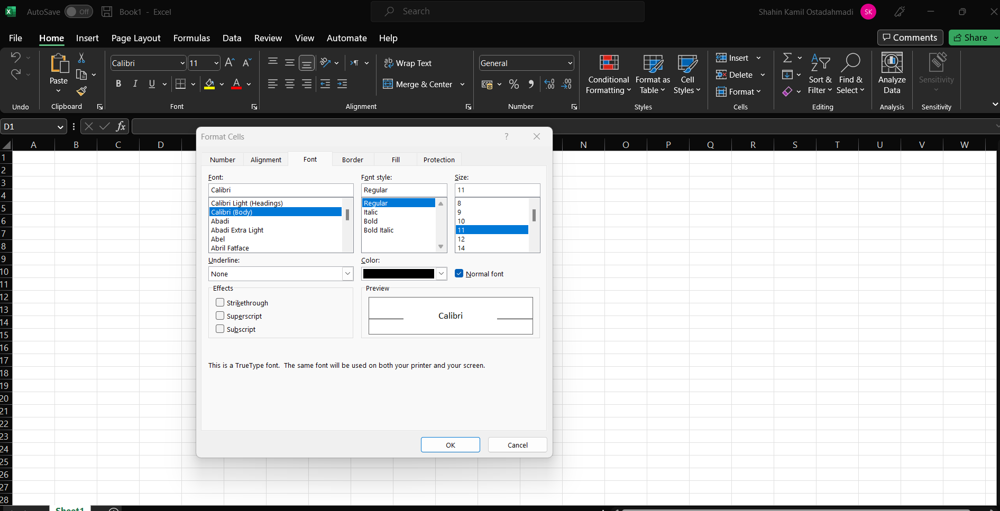
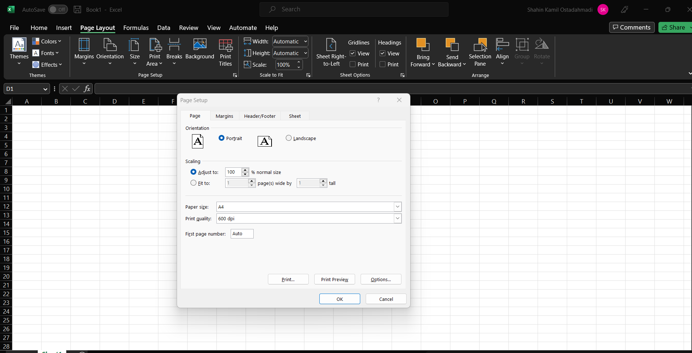

# Multiple dialogs 

Agenda for denne forelesningen: 

- Lage flere dialoger (vi har jobbet med bare en hittil)
- Hvordan "tvinge" brukeren til å bruke en bestemt "dialog" 
- Hvordan sende data mellom dialoger 

Vi er allerede kjent med Dialog som et vindu, men i en applikasjon er det ofte behov for å ha flere dialoger slik at vi kan gi en god og oversiktlig opplevelse til brukeren. Gjennom bruk av programmer som word, excel og lignenede har vi sett flere Dialoger som har en spesifikk oppgave. Se bilder for noen eksempler. 

**Du kan lese mere om Qt Dialog her:** [Qt dialog](https://doc.qt.io/qt-6/qdialog.html)

**Dialog for å formatere celler på excel:**



**Dialog for ark innstillinger på excel:**



## Lage flere dialoger

1. Lag en ny Dialog klasse
2. Sett opp UI (gjøres på samme måte som vi har gjort hittil)
3. Lag en objekt dialogen der du ønsker det

Vi vil nå ha to .ui filer, en for hver dialog og de fungerer akkurat på samme måte. 

### Lage dialog med parent: 
Når vi lager en dialog med parent, lager vi en "parent" og "child" relasjon. Når "parent" dialogen avsluttes vil også "child" dialogen avsluttes automatisk.

```C++

// i man lager vi hoved dialogen

int main(int argc, char *argv[])
{
    QApplication a(argc, argv);
    Dialog w;
    w.show();
    return a.exec();
}

// En knapp for å lage en ny dialog 

void Dialog::btnMakeDialogWithParent()
{
   // dialog 2 har "denne" dialogen som "parent"
   QDialog *dialog_2_ptr = new Dialog_2(this);
   dialog_2_ptr->show();
}

```

### Lage dialog uten parent:

Å lage en dialog uten "parent" er slik som vi har laget alle våre dialoger tidligere slik som dere ser i main.  


```C++
int main(int argc, char *argv[])
{
    QApplication a(argc, argv);
    Dialog w;
    w.show();
    return a.exec();
}

void Dialog::btnMakeDialogNoParent()
{
    // Denne dialogen har ingen "parent"
    QDialog *dialog_2_ptr = new Dialog_2(nullptr);
    dialog_2_ptr->show();
}
Vi kan også lage flere slike med en knapp for eksemepl. 
```

### Modal dialog 

Modal dialog blokerer alt interaksjon med andre vinduer i samme applikasjon så lenge dialogen er åpen. Det vil si at når vi har en Modal dialog åpen kan vi kun samhandle med den åpne dialogen, alt annet er blokkert til du lukker dialogen. 

Eksempel: I "filsystemer" har en en FontComboBox for å bestemme fonten til vår TextEdit. Vi ønsker nå flere funksjonalitet som skriftstørrelse, posisjon, understrek og mange andre ting. For å holde applikasjonen ryddig kan vi lage en knapp som heter for eks. "Style" som åpner en ny dialog hvor vi kan få tilgang til å endre skriftstørrelse, posisjon etc. 


