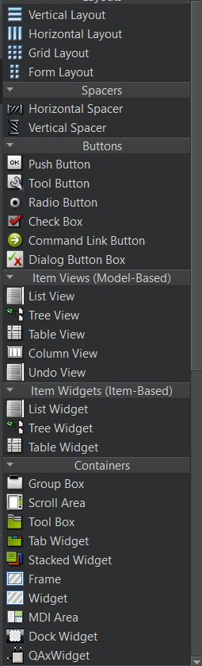

# Viktige temaer

**Generell kunnskap:** Det er viktig å ha kunnskap om hvordan man kan legge til skjermelement (Widget) som knapper, listview, radioknapper, checkboxes og etc. enten via kode eller UI designeren. Videre må man kunne knytte disse skjermelementene til funksjoner/slots for at de skal være funksjonelle. 

Her er eksempler på skjermelementer på QT Creator: 

**Signaler og slots:** Signaler og slots er en viktig del applikasjonsutvikling og brukes nesten overalt. En må kunne bruke signaler og slots for å kommunisere på tvers av applikasjonen. Det er fordel å kunne lage/definere signaler for egen lagde klasser.   

**QMainWindow:** 

    - Hvordan opprette QMainWindow
    - Legge til og definere menyer og actions
    - Lage dialoger dynamisk, eks. Popup dialog når vi trykker på en action som "Help". 
    - Kommunikasjon mellom QDialog og QMainwindow
    
**QDialog:** 

    - Opprette en eller flere QDialog klasser
    - Kommunikasjon mellom to dialoger

**Filsystemer:** Du må kunne å lese/skrive til filer/mapper via applikasjonen. Det er viktig å kjenne til metodene: readonly, writeonly og readwrite når man ber operativsystemet om tilgang til en fil. 

**Settings:** ha grunnleggende kunnskap om QSettings. 